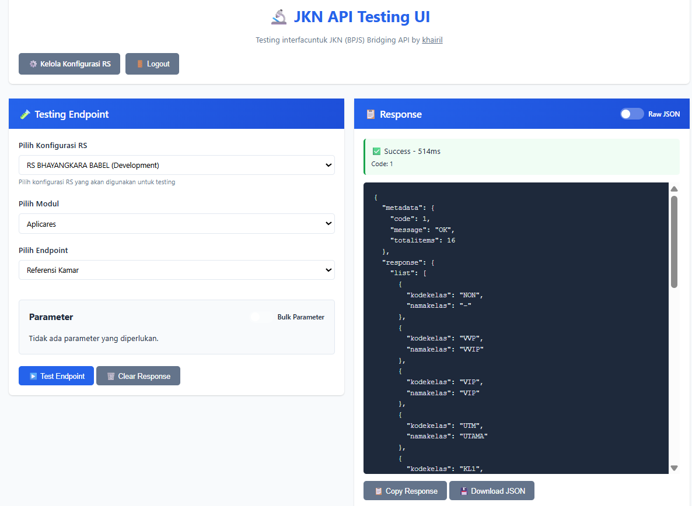

# JKN API Testing UI

[](CONTRIBUTING.md)
[](https://opensource.org/licenses/MIT)

UI interaktif untuk testing berbagai endpoint JKN (BPJS) Bridging API dengan mudah dan cepat.



## 📋 Tentang

Aplikasi web ini menyediakan antarmuka grafis untuk menguji berbagai endpoint API JKN (BPJS) seperti VClaim, Antrean, Aplicares, Apotek, PCare, ICare, dan Rekam Medis. 

**Testing interface untuk JKN (BPJS) Bridging API by khairil**

## 🤝 Kolaborasi & Kredit

Aplikasi ini dibangun dengan kolaborasi menggunakan library:

- **[@ssecd/jkn](https://github.com/ssecd/jkn)** - JKN (BPJS) Bridging API untuk NodeJS, Deno, dan Bun
  - Dibuat oleh [Habib Mustofa](https://github.com/mustofa-id)
  - Repository: https://github.com/ssecd/jkn
  - NPM Package: https://www.npmjs.com/package/@ssecd/jkn
  - Lisensi: MIT

Library `@ssecd/jkn` menyediakan wrapper TypeScript yang lengkap untuk JKN Bridging API, yang memungkinkan aplikasi testing UI ini dapat mengakses semua endpoint dengan mudah dan type-safe. Semua kredit untuk implementasi core API JKN diberikan kepada pembuat library original tersebut.

## ✨ Fitur

- ✅ **Multi-Configuration**: Simpan dan kelola konfigurasi untuk multiple RS (Rumah Sakit)
- ✅ **Database Lokal**: Konfigurasi disimpan di SQLite database lokal (bisa di-share dengan tim)
- ✅ **Autentikasi**: Sistem login untuk keamanan aplikasi
- ✅ **Testing Interaktif**: UI yang mudah digunakan untuk testing berbagai endpoint
- ✅ **Bulk Mode**: Test multiple requests sekaligus dengan variasi parameter berbeda
- ✅ **Form State Persistence**: Form state tersimpan otomatis saat refresh
- ✅ **Export/Import**: Backup dan restore konfigurasi
- ✅ **Raw JSON View**: Toggle untuk melihat response dalam format raw JSON
- ✅ **Support Semua Modul**: Antrean, Aplicares, VClaim, Apotek, PCare, ICare, Rekam Medis

## 🚀 Instalasi

### Prasyarat

- Node.js 18+ atau Bun/Deno
- pnpm (disarankan) atau npm

### Langkah Instalasi

1. **Clone repository**
   ```bash
   git clone <repository-url>
   cd jkn-testing
   ```

2. **Install dependencies**
   ```bash
   # Menggunakan pnpm (disarankan)
   pnpm install
   
   # Atau menggunakan npm
   npm install
   ```

3. **Setup Environment Variables (Opsional)**
   
   Buat file `.env` di root project untuk mengatur konfigurasi default:
   ```env
   # Session Secret (WAJIB diubah untuk production!)
   SESSION_SECRET=your-very-secure-random-secret-key-here
   
   # Default User Credentials (WAJIB diubah untuk production!)
   DEFAULT_USERNAME=khairil
   DEFAULT_PASSWORD=password123
   
   # Server Port
   PORT=3000
   ```

4. **Jalankan Server**
   ```bash
   # Development mode (dengan auto-reload)
   pnpm run ui:dev
   
   # Production mode
   pnpm run ui
   ```

5. **Buka Browser**
   
   Buka http://localhost:3000 di browser Anda

## 🔐 Autentikasi

### Default Credentials

**⚠️ PENTING: Ganti kredensial default sebelum deploy ke production!**

Default credentials saat pertama kali install:
- **Username**: `khairil`
- **Password**: `password123`

Untuk mengubah default credentials, set environment variables:
```bash
export DEFAULT_USERNAME=your-username
export DEFAULT_PASSWORD=your-secure-password
```

Atau buat file `.env`:
```env
DEFAULT_USERNAME=khairil
DEFAULT_PASSWORD=password123
```

### Keamanan

- Password disimpan dalam bentuk hash menggunakan bcrypt
- Session menggunakan cookie httpOnly untuk mencegah XSS
- Semua API endpoints dilindungi (kecuali login)
- Session berlaku selama 24 jam

## 📖 Cara Menggunakan

### 1. Login

Setelah server berjalan, Anda akan diarahkan ke halaman login. Masukkan username dan password.

### 2. Konfigurasi RS

1. Klik "⚙️ Kelola Konfigurasi" di header
2. Klik "➕ Tambah RS Baru"
3. Isi form dengan kredensial BPJS:
   - **Nama Rumah Sakit**: Nama untuk identifikasi
   - **Mode Environment**: Development atau Production
   - **Kode PPK**: Kode PPK dari BPJS
   - **Cons ID**: Consumer ID dari BPJS
   - **Cons Secret**: Consumer Secret dari BPJS
   - **User Keys**: User key untuk masing-masing modul (VClaim, Antrean, PCare, dll)
4. Klik "💾 Simpan Konfigurasi"

Konfigurasi akan tersimpan di database lokal (`web/config.db`) dan bisa diakses oleh semua user yang menggunakan aplikasi ini.

### 3. Testing Endpoint

1. Pilih **Konfigurasi RS** yang akan digunakan
2. Pilih **Modul** (Antrean, Aplicares, VClaim, dll)
3. Jika modul memiliki submodul, pilih **Submodul**
4. Pilih **Endpoint** yang ingin di-test
5. Isi **Parameter** yang diperlukan
6. Klik "▶️ Test Endpoint"
7. Lihat hasil di panel **Response**

### 4. Bulk Parameter Mode

Untuk test multiple requests dengan variasi parameter berbeda:

1. Pilih endpoint yang ingin di-test
2. Aktifkan toggle **"Bulk Parameter"**
3. Input JSON array dengan format:
   ```json
   [
     {
       "param1": "value1",
       "param2": "value2"
     },
     {
       "param1": "value3",
       "param2": "value4"
     }
   ]
   ```
4. Klik "📋 Load Template" untuk melihat contoh format
5. Klik "▶️ Test Endpoint"

Semua request akan diproses secara paralel dan hasilnya ditampilkan dalam array.

### 5. Export/Import Konfigurasi

- **Export**: Klik "📤 Export" untuk download konfigurasi sebagai file JSON
- **Import**: Klik "📥 Import" untuk upload dan restore konfigurasi dari file JSON

## 🗄️ Database

Aplikasi menggunakan SQLite database lokal untuk menyimpan:
- **Konfigurasi RS**: Semua konfigurasi rumah sakit
- **Users**: Data user untuk autentikasi

Database file: `web/config.db`

**⚠️ Catatan Keamanan:**
- File `config.db` berisi kredensial sensitif
- Jangan commit file `config.db` ke Git (sudah ada di `.gitignore`)
- Backup database secara berkala
- Gunakan environment variables untuk production

## 📁 Struktur Project

```
jkn-testing/
├── src/                    # Source code library JKN (dari @ssecd/jkn)
│   └── pcare/             # PCare submodules
│       ├── dokter.ts      # Submodul Dokter
│       ├── kelompok.ts   # Submodul Kelompok
│       ├── kesadaran.ts  # Submodul Kesadaran
│       ├── kunjungan.ts  # Submodul Kunjungan
│       ├── mcu.ts        # Submodul MCU
│       ├── obat.ts       # Submodul Obat
│       ├── pendaftaran.ts # Submodul Pendaftaran
│       ├── poli.ts       # Submodul Poli
│       ├── provider.ts   # Submodul Provider
│       ├── spesialis.ts  # Submodul Spesialis
│       ├── status-pulang.ts # Submodul Status Pulang
│       ├── alergi.ts     # Submodul Alergi
│       ├── prognosa.ts   # Submodul Prognosa
│       ├── tindakan.ts   # Submodul Tindakan
│       └── skrinning.ts  # Submodul Skrining
├── web/                    # Web UI application
│   ├── index.html         # Halaman utama testing
│   ├── config.html        # Halaman konfigurasi
│   ├── login.html         # Halaman login
│   ├── app.js             # Frontend JavaScript
│   ├── styles.css         # Styling
│   ├── server.ts          # Express server
│   ├── database.ts        # Database operations
│   └── config.db          # SQLite database (tidak di-commit)
├── package.json
├── README.md              # Dokumentasi ini
└── .gitignore
```

## 📚 Modul dan Submodul yang Tersedia

Aplikasi ini mendukung berbagai modul JKN (BPJS) Bridging API dengan endpoint-endpoint berikut:

### Antrean
- `refPoli` - Referensi Poli
- `refDokter` - Referensi Dokter
- `refJadwalDokter` - Referensi Jadwal Dokter
- `refPoliFp` - Referensi Poli Fingerprint
- `refPasienFp` - Referensi Pasien Fingerprint
- `updateJadwalDokter` - Update Jadwal Dokter
- `tambah` - Tambah Antrean
- `tambahFarmasi` - Tambah Antrean Farmasi
- `updateWaktu` - Update Waktu Antrean
- `batal` - Batal Antrean
- `listTaskId` - List Waktu TaskId
- `dashboardPerTanggal` - Dashboard Per-Tanggal
- `dashboardPerBulan` - Dashboard Per-Bulan
- `perTanggal` - Antrean Per-Tanggal
- `perKodeBooking` - Antrean Per-KodeBooking
- `belumDilayani` - Antrean Belum Dilayani
- `belumDilayaniPredikat` - Antrean Belum Dilayani Per-(Poli, Dokter, Hari, Jam)

### Aplicares
- `refKamar` - Referensi Kamar
- `update` - Update Ketersediaan Tempat Tidur
- `create` - Buat Ruangan Baru
- `read` - Ketersediaan Kamar Faskes
- `delete` - Hapus Ruangan

### VClaim
#### Peserta
- `nomorKartu` - Peserta by Nomor Kartu
- `nomorKependudukan` - Peserta by NIK

#### Referensi
- `diagnosa` - Referensi Diagnosa
- `poli` - Referensi Poli
- `faskes` - Referensi Faskes
- `dpjp` - Referensi DPJP
- `provinsi` - Referensi Provinsi
- `kabupaten` - Referensi Kabupaten
- `kecamatan` - Referensi Kecamatan
- `diagnosaPrb` - Referensi Diagnosa PRB
- `obatPrb` - Referensi Obat PRB
- `klaimProsedur` - Referensi Prosedur (Klaim)
- `klaimKelasRawat` - Referensi Kelas Rawat (Klaim)
- `klaimDokter` - Referensi Dokter (Klaim)
- `klaimSpesialistik` - Referensi Spesialistik (Klaim)
- `klaimRuangRawat` - Referensi Ruang Rawat (Klaim)
- `klaimCaraKeluar` - Referensi Cara Keluar (Klaim)
- `klaimPaskaPulang` - Referensi Paska Pulang (Klaim)

#### SEP
- `insert` - SEP Insert v1.1
- `insertV2` - SEP Insert v2.0
- `update` - SEP Update v1.1
- `updateV2` - SEP Update v2.0
- `delete` - SEP Delete v1.1
- `deleteV2` - SEP Delete v2.0
- `cari` - SEP Detail by Nomor
- `cariByRujukan` - SEP Detail Terakhir by Rujukan
- `suplesiJasaRaharja` - SEP Suplesi Jasa Raharja
- `dataIndukKecelakaan` - SEP Data Induk Kecelakaan
- `pengajuan` - SEP Pengajuan
- `approvalPengajuan` - SEP Approval Pengajuan
- `listPersetujuan` - SEP List Persetujuan
- `updateTanggalPulangV2` - SEP Update Tanggal Pulang v2.0
- `listTanggalPulang` - SEP List Update Tanggal Pulang
- `inacbg` - SEP INACBG
- `listInternal` - SEP List Internal
- `deleteInternal` - SEP Delete Internal
- `fingerPrint` - SEP Status Fingerprint
- `listFingerPrint` - SEP List Fingerprint
- `listRandomQuestions` - SEP List Random Question
- `sendRandomQuestionAnswers` - SEP Kirim Jawaban Random Question

#### Rujukan
- `cariByNomor` - Rujukan Cari by Nomor
- `cariByNoka` - Rujukan Cari by Nomor Kartu
- `cariByNokaMulti` - Rujukan Cari Multi by Nomor Kartu
- `insert` - Rujukan Insert
- `update` - Rujukan Update
- `delete` - Rujukan Delete
- `insertKhusus` - Rujukan Khusus Insert
- `deleteKhusus` - Rujukan Khusus Delete
- `listKhusus` - Rujukan Khusus List
- `insertV2` - Rujukan Insert v2.0
- `updateV2` - Rujukan Update v2.0
- `listSpesialistik` - Rujukan List Spesialistik
- `listSarana` - Rujukan List Sarana
- `listKeluar` - Rujukan List Keluar Faskes
- `keluarByNomor` - Rujukan Detail Keluar by Nomor
- `jumlahSep` - Rujukan Jumlah SEP by Nomor Rujukan

#### Rencana Kontrol
- `insert` - Rencana Kontrol Insert
- `insertV2` - Rencana Kontrol Insert v2
- `update` - Rencana Kontrol Update
- `updateV2` - Rencana Kontrol Update v2
- `delete` - Rencana Kontrol Delete
- `insertSPRI` - Rencana Kontrol Insert SPRI
- `updateSPRI` - Rencana Kontrol Update SPRI
- `sep` - Rencana Kontrol Data SEP
- `cari` - Rencana Kontrol Detail Surat Kontrol
- `dataByNoka` - Rencana Kontrol List by Nomor Kartu
- `dataByTanggal` - Rencana Kontrol List by Tanggal
- `poli` - Rencana Kontrol Data Poli
- `dokter` - Rencana Kontrol Data Dokter

#### PRB
- `insert` - PRB Insert
- `update` - PRB Update
- `delete` - PRB Delete
- `cariByNomor` - PRB Cari by Nomor SRB
- `cariByTanggal` - PRB Cari by Tanggal SRB
- `rekapPotensi` - PRB Rekap Potensi

#### Monitoring
- `kunjungan` - Monitoring Data Kunjungan
- `klaim` - Monitoring Data Klaim
- `riwayatPelayanan` - Monitoring Riwayat Pelayanan
- `klaimJasaRaharja` - Monitoring Klaim Jasa Raharja

#### LPK
- `insert` - LPK Insert
- `update` - LPK Update
- `delete` - LPK Delete
- `data` - LPK Data Pengajuan Klaim

### Apotek
#### Referensi
- `dpho` - Referensi DPHO
- `poli` - Referensi Poli
- `faskes` - Referensi Faskes (PPK)
- `settingApotek` - Referensi Setting Apotek
- `spesialistik` - Referensi Spesialistik
- `obat` - Referensi Obat

#### Obat
- `saveNonRacikan` - Obat Simpan Non Racikan
- `saveRacikan` - Obat Simpan Racikan
- `updateStok` - Obat Update Stok

#### Pelayanan Obat
- `daftar` - Pelayanan Obat Daftar Pelayanan
- `riwayat` - Pelayanan Obat Riwayat
- `hapus` - Pelayanan Obat Hapus

#### Resep
- `simpan` - Resep Simpan
- `hapus` - Resep Hapus
- `daftar` - Resep Daftar

#### SEP
- `kunjungan` - SEP Data Kunjungan

#### Monitoring
- `dataKlaim` - Monitoring Data Klaim Resep

#### PRB
- `rekapPeserta` - PRB Rekap Peserta

### PCare
#### Peserta
- `nomorKartu` - Peserta by Nomor Kartu
- `nomorKependudukan` - Peserta by NIK

#### Dokter
- `index` - Get Data Dokter (dengan pagination)

#### Kelompok
- `club` - Get Data Club Prolanis
- `kegiatan` - Get Data Kegiatan Kelompok
- `peserta` - Get Data Peserta Kegiatan Kelompok
- `addKegiatan` - Add Data Kegiatan Kelompok
- `addPeserta` - Add Data Peserta Kegiatan Kelompok
- `deleteKegiatan` - Delete Data Kegiatan Kelompok
- `deletePeserta` - Delete Data Peserta Kegiatan Kelompok

#### Kesadaran
- `index` - Get Data Kesadaran

#### Kunjungan
- `rujukan` - Get Data Rujukan
- `peserta` - Get Data Riwayat Kunjungan
- `add` - Add Data Kunjungan
- `edit` - Edit Data Kunjungan
- `delete` - Delete Data Kunjungan

#### MCU
- `kunjungan` - Get Data MCU
- `add` - Add Data MCU
- `edit` - Edit Data MCU
- `delete` - Delete Data MCU

#### Obat
- `dpho` - Get Data DPHO
- `dphoByKdppk` - Get DPHO by KDPPK
- `kunjungan` - Get Obat by Kunjungan
- `add` - Add Data Obat
- `delete` - Delete Data Obat

#### Pendaftaran
- `noUrut` - Get Pendaftaran by Nomor Urut
- `tglDaftar` - Get Pendaftaran Provider
- `add` - Add Data Pendaftaran
- `delete` - Delete Data Pendaftaran

#### Poli
- `fktp` - Get Data Poli FKTP (dengan pagination)

#### Provider
- `index` - Get Provider Rayonisasi (dengan pagination)

#### Spesialis
- `index` - Get Referensi Spesialis
- `subSpesialis` - Get Referensi Sub Spesialis
- `sarana` - Get Referensi Sarana
- `khusus` - Get Referensi Khusus
- `rujukSubSpesialis` - Get Faskes Rujukan Sub Spesialis
- `rujukKhusus` - Get Faskes Rujukan Khusus (IGD, HDL, JIW, KLT, PAR, KEM, RAT, HIV)
- `rujukKhususThaHem` - Get Faskes Rujukan Khusus (THA, HEM)

#### Status Pulang
- `rawatInap` - Get Status Pulang (by rawatInap: true/false)

#### Alergi
- `jenis` - Get Data Alergi (01:Makanan, 02:Udara, 03:Obat)

#### Prognosa
- `index` - Get Prognosa

#### Tindakan
- `kunjungan` - Get Tindakan by Kunjungan
- `kdTkp` - Get Referensi Tindakan
- `add` - Add Data Tindakan
- `edit` - Edit Data Tindakan
- `delete` - Delete Data Tindakan

#### Skrining
- `rekap` - Get Skrining Riwayat Kesehatan by Penyakit
- `peserta` - Get Detail Peserta Skrining Riwayat Kesehatan
- `prolanisDm` - Get Data Prolanis Diabetes Mellitus
- `prolanisHt` - Get Data Prolanis Hipertensi

### ICare
- `fkrtl` - ICare FKRTL
- `fktp` - ICare FKTP

### Rekam Medis
- `insert` - Insert Rekam Medis

**Catatan Penting:**
- Semua endpoint POST/PUT yang menggunakan JSON body memerlukan parameter `request` atau `data` dengan tipe `textarea` di UI
- Format tanggal untuk beberapa endpoint menggunakan format `dd-mm-yyyy` (khusus PCare), sedangkan yang lain menggunakan `YYYY-MM-DD`
- Beberapa endpoint memerlukan pagination dengan parameter `start` dan `limit`
- Response type untuk setiap endpoint telah disesuaikan dengan dokumentasi API BPJS

## 🔧 Konfigurasi Lanjutan

### Environment Variables

| Variable | Deskripsi | Default |
|----------|-----------|---------|
| `PORT` | Port server | `3000` |
| `SESSION_SECRET` | Secret key untuk session | `jkn-testing-secret-key-change-in-production` |
| `DEFAULT_USERNAME` | Username default | `khairil` |
| `DEFAULT_PASSWORD` | Password default | `password123` |
| `NODE_ENV` | Environment mode | `development` |

### Mengubah Port

```bash
PORT=8080 pnpm run ui
```

## 🐛 Troubleshooting

### Error: "Cannot find package 'better-sqlite3'"

Install dependencies:
```bash
pnpm install
# atau
npm install
```

### Error: "Authentication failed"

1. Periksa kembali semua kredensial di halaman Konfigurasi
2. Pastikan tidak ada spasi di awal/akhir saat copy-paste
3. Pastikan mode environment sesuai (Development/Production)
4. Pastikan User Key sesuai dengan modul yang digunakan

### Database locked error

Tutup aplikasi lain yang mungkin menggunakan database, atau restart server.

## 📝 Catatan Penting

- ⚠️ **Jangan commit file `config.db`** ke Git (berisi kredensial sensitif)
- ⚠️ **Ganti default password** sebelum deploy ke production
- ⚠️ **Ganti SESSION_SECRET** untuk production
- ✅ Database bisa di-share dengan tim melalui file sharing atau Git LFS
- ✅ Konfigurasi tersimpan di database lokal, bukan localStorage

## 🤝 Kontribusi

Kontribusi sangat dipersilakan dan dihargai! Project ini terbuka untuk semua kontributor yang ingin membantu meningkatkan aplikasi ini.

### Cara Berkontribusi

Ada banyak cara untuk berkontribusi:

1. **🐛 Melaporkan Bug**
   - Gunakan [GitHub Issues](https://github.com/hairil2912/jkn-testing/issues) untuk melaporkan bug
   - Jelaskan masalah dengan detail, termasuk langkah-langkah untuk reproduce
   - Sertakan informasi environment (OS, Node.js version, dll)

2. **💡 Mengusulkan Fitur Baru**
   - Buka issue dengan label `enhancement` atau `feature request`
   - Jelaskan use case dan manfaat fitur yang diusulkan
   - Diskusikan ide Anda dengan maintainer sebelum implementasi besar

3. **📝 Meningkatkan Dokumentasi**
   - Perbaiki typo atau kesalahan dalam dokumentasi
   - Tambahkan contoh penggunaan atau tutorial
   - Terjemahkan dokumentasi ke bahasa lain

4. **💻 Submit Pull Request**
   - Fork repository ini
   - Buat branch baru untuk fitur/bugfix Anda (`git checkout -b feature/amazing-feature`)
   - Commit perubahan Anda (`git commit -m 'Add some amazing feature'`)
   - Push ke branch (`git push origin feature/amazing-feature`)
   - Buka Pull Request

### Panduan Pull Request

Sebelum submit Pull Request, pastikan:

- ✅ **Code Style**: Ikuti code style yang sudah ada di project
- ✅ **Testing**: Test perubahan Anda sebelum submit
- ✅ **Documentation**: Update dokumentasi jika diperlukan
- ✅ **Commit Messages**: Gunakan commit message yang jelas dan deskriptif
- ✅ **One PR = One Feature**: Satu PR untuk satu fitur/bugfix
- ✅ **No Breaking Changes**: Hindari breaking changes tanpa diskusi terlebih dahulu

### Format Commit Message

Gunakan format berikut untuk commit message:

```
<type>(<scope>): <subject>

<body>

<footer>
```

**Types:**
- `feat`: Fitur baru
- `fix`: Bug fix
- `docs`: Perubahan dokumentasi
- `style`: Formatting, missing semi colons, dll
- `refactor`: Code refactoring
- `test`: Menambah/memperbaiki test
- `chore`: Maintenance tasks

**Contoh:**
```
feat(ui): Add dark mode toggle

Menambahkan toggle untuk dark mode di header
- Add dark mode CSS variables
- Add toggle button di header
- Persist preference di localStorage

Closes #123
```

### Development Setup

1. **Fork & Clone**
   ```bash
   git clone https://github.com/YOUR_USERNAME/jkn-testing.git
   cd jkn-testing
   ```

2. **Install Dependencies**
   ```bash
   pnpm install
   ```

3. **Buat Branch**
   ```bash
   git checkout -b feature/your-feature-name
   ```

4. **Development**
   ```bash
   # Run development server dengan auto-reload
   pnpm run ui:dev
   ```

5. **Test Changes**
   - Test semua fitur yang berubah
   - Pastikan tidak ada error di console
   - Test di browser yang berbeda jika diperlukan

6. **Commit & Push**
   ```bash
   git add .
   git commit -m "feat: your feature description"
   git push origin feature/your-feature-name
   ```

7. **Create Pull Request**
   - Buka GitHub dan buat Pull Request
   - Jelaskan perubahan yang Anda buat
   - Link ke related issue jika ada

### Code of Conduct

- Bersikap respek terhadap semua kontributor
- Terima feedback dengan baik
- Fokus pada apa yang terbaik untuk project
- Bersikap profesional dan konstruktif

### Area yang Membutuhkan Kontribusi

- 🌐 **Internationalization**: Terjemahan ke bahasa lain
- 🎨 **UI/UX Improvements**: Perbaikan tampilan dan user experience
- 🧪 **Testing**: Menambah test coverage
- 📚 **Documentation**: Contoh penggunaan, tutorial, dll
- 🐛 **Bug Fixes**: Fix bug yang dilaporkan
- ⚡ **Performance**: Optimasi performa aplikasi
- 🔒 **Security**: Perbaikan keamanan

### Pertanyaan?

Jika Anda memiliki pertanyaan tentang cara berkontribusi, silakan:
- Buka [GitHub Discussion](https://github.com/hairil2912/jkn-testing/discussions)
- Atau buat issue dengan label `question`

**Terima kasih telah berkontribusi! 🙏**

## 📄 Lisensi

MIT License

## 🙏 Acknowledgments

- [@ssecd/jkn](https://github.com/ssecd/jkn) - Library utama untuk JKN Bridging API
- [Habib Mustofa](https://github.com/mustofa-id) - Pembuat library @ssecd/jkn

## 🔗 Links

- [Library Original (@ssecd/jkn)](https://github.com/ssecd/jkn)
- [NPM Package](https://www.npmjs.com/package/@ssecd/jkn)
- [BPJS TrustMark](https://dvlp.bpjs-kesehatan.go.id:8888/trust-mark/main.html)
- [Contributing Guide](CONTRIBUTING.md)

---

**Made with ❤️ by [khairil](https://github.com/hairil2912)**

**Contributions are welcome! See [CONTRIBUTING.md](CONTRIBUTING.md) for guidelines.**

**Made with ❤️ by [khairil](https://github.com/hairil2912)**

**Contributions are welcome! See [CONTRIBUTING.md](CONTRIBUTING.md) for guidelines.**